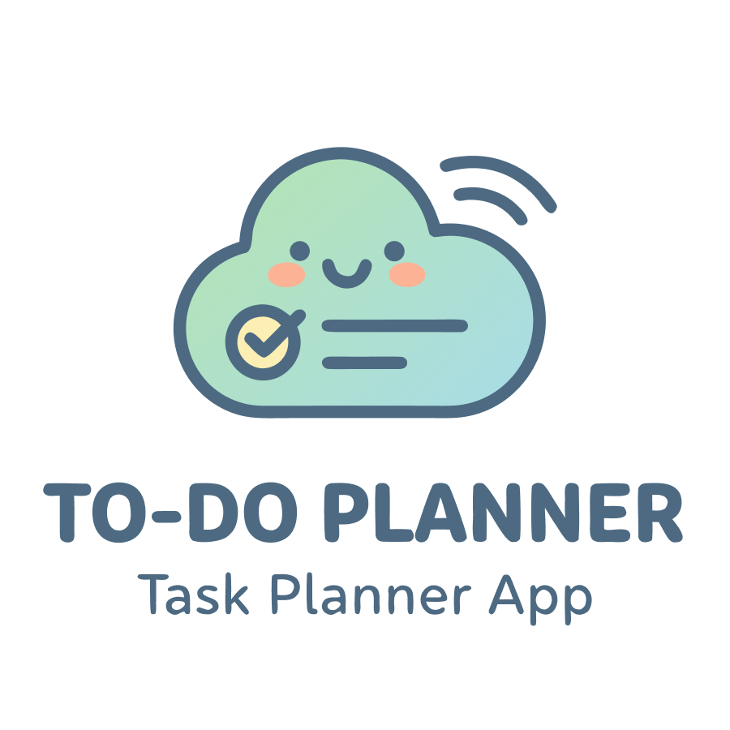
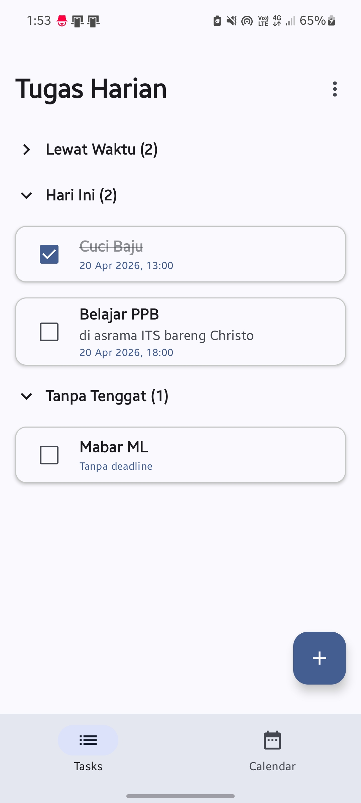
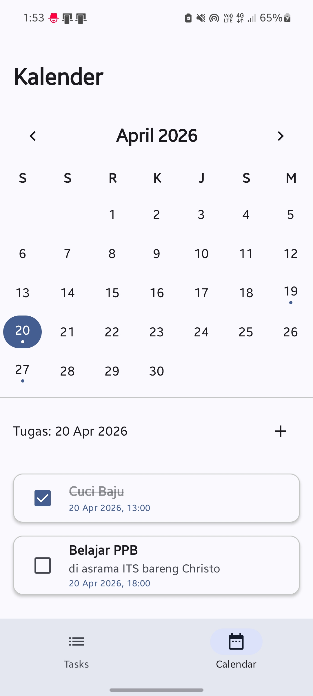

  

<h1 align="center">To-Do Planner</h1>

  
  &nbsp;
  

> Aplikasi pengelola tugas dan jadwal harian bergaya modern yang dirancang untuk mempermudah produktivitas Anda, dibangun sepenuhnya menggunakan teknologi Jetpack Compose.

## 📖 Tentang
**To-Do Planner** adalah solusi produktivitas lengkap untuk mencatat, menjadwalkan, dan melacak daftar pekerjaan sehari-hari. Aplikasi ini dikembangkan untuk memberikan pengalaman navigasi yang sangat responsif, mulus, dan intuitif melalui gestur *swipe*, sekaligus memastikan mobilitas yang terjamin amannya lewat penyimpanan **secara offline di perangkat**. Dibuat khusus dan dioptimalkan sebagai pemenuhan evaluasi project ETS Pemrograman Perangkat Bergerak.

## ✨ Fitur Utama
- **Navigasi Cepat Berbasis Swipe:** Transisi mulus antara layar **Daftar Tugas** dan **Kalender** menggunakan HorizontalPager yang intuitif.
- **Daftar Tugas Cerdas:** Memisahkan tugas secara otomatis (*Lewat Waktu, Hari Ini, Besok, Lusa, Tanpa Tenggat*).
- **Kalender Interaktif:** Kalender visual bulanan interaktif dengan titik penanda sebagai representatif hari-hari yang memiliki daftar tugas.
- **Manajemen Penjadwalan Lanjut:** Dilengkapi opsi penentuan opsi tanggal dan jam, termasuk **Tugas Berulang** (Harian, Mingguan, Bulanan, hingga Kustom hari spesifik) dengan pengaturan batas tamat fitur berulang yang luar biasa fleksibel.
- **Interaksi Material Design 3:** Menghapus tugas lebih instan dengan di-*swipe*, mendukung notifikasi balikan pembatalan (*Undo* Snackbar).
- **Estetika Antarmuka Penuh:** Animasi *Splash Screen* logo di awal pembukaan, resolusi UI kartu/papan daftar yang hemat *spaces* dan ramah memori otak.

## 📱 Screenshot Terkini
| Daftar Tugas (Tasks) | Kalender Terintegrasi (Calendar) |
| :---: | :---: |
|  |  |

## 📥 Download APK
Anda dapat melihat semua versi aplikasi yang pernah dirilis melalui halaman **GitHub Releases**. Di sini, Anda juga bisa mengunduh versi terbaru aplikasi dengan mudah.

👉 **[Lihat Semua Versi Rilis](https://github.com/azharax/ETS-PPB/releases)**

Untuk mengunduh **APK stabil terbaru**, silakan klik tombol di bawah ini:

⬇️ **[Download APK Terbaru](#download-badge)**

## ⚙️ Petunjuk Instalasi
1. Unduh bundle apk dari tautan di atas.
2. Buka paket instaler yang terunduh tersebut di dalam perangkat Android Anda.
3. Apabila muncul peringatan keamanan sistem, mohon izinkan penginstalan dari **Sumber Tidak Dikenal (Unknown Sources)** pada pengaturan keamanan ponsel.
4. Lanjutkan instruksi di layar instalasi, tunggu sampai jadi, dan aplikasi siap digunakan!

## 🛠️ Stack Teknologi & Arsitektur
Dibuat dengan mematuhi pattern asitektur masa kini, yakni **MVVM (Model-View-ViewModel)** dengan spesifikasi berikut:
- **Bahasa Independen:** Kotlin
- **UI & Layouting:** Jetpack Compose (Material 3)
- **Reactivity & Threading:** Kotlin Coroutines beserta StateFlow Flow
- **Lapisan Penyimpanan:** Room Database SQLite (Local Storage)

## 📝 Changelog / Catatan Rilis
### v1.0.0 (Rilis Publik)
- Daftar tugas otomatis dikelompokkan berdasarkan waktu: lewat waktu, hari ini, besok, lusa, dan tanpa tenggat.
- Kalender interaktif dengan penanda tugas pada tanggal tertentu.
- Dukungan tugas berulang harian, mingguan, bulanan, atau hari tertentu.
- Bisa edit tugas kapan saja.
- Hapus tugas dengan swipe, lalu bisa dibatalkan lewat undo.
- Tampilan modern, ringan, dan nyaman dipakai.

